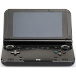

# GPD XD

  
|Component|Description                                              |
|---------|---------------------------------------------------------|
|CPU      |Rockchip RK3288 ARM Cortex-A17 1.4GHz                    |
|GPU      |Mali-T764 600MHz                                         |
|RAM      |2GB                                                      |
|Screen   |5.0" 1280x720 (Capacitive Touch)                         |
|Slot     |MicroSD                                                  |
|WLAN     |Wi-Fi 802.11 b/g/n/ac                                    |
|Gamepad  |DPad, 4 Buttons, Start, Select, L1, L2, L3, R1, R2 and R3|
|Battery  |3.7V 5600mA                                              |
|Dimension|155mm x 89mm x 24mm                                      |
|Weight   |300g                                                     |

### https://steward-fu.github.io/website/index.htm
